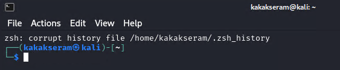

# Corrupt ZSH history file

If you use zsh for your shell very occasionally you may find the following message appearing indicating a corrupt history file.



To fix it run the following commands

```
cd ~
mv .zsh_history .zsh_history_bad
strings .zsh_history_bad > .zsh_history
fc -R .zsh_history
rm ~/.zsh_history_bad
```

