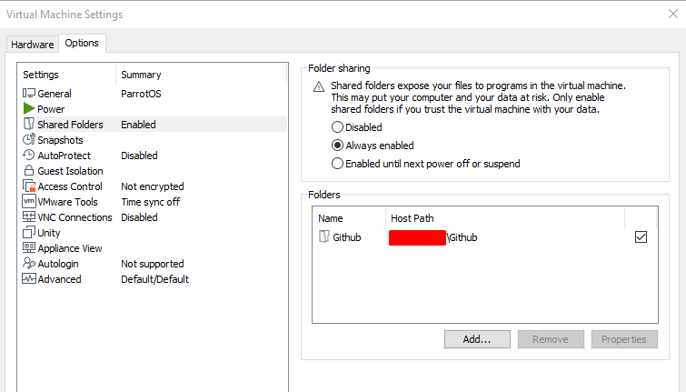
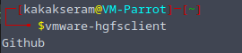
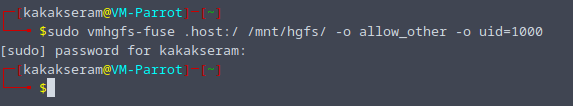

# Mount Shared Folder

Mount Shared Folder Linux on VMware

* Set shared folder on VMware properties

    

* Check VMware share folder

    `vmware-hgfsclient`

    

*  Mount folder

    `sudo vmhgfs-fuse .host:/ /mnt/hgfs/ -o allow_other -o uid=1000`

    
